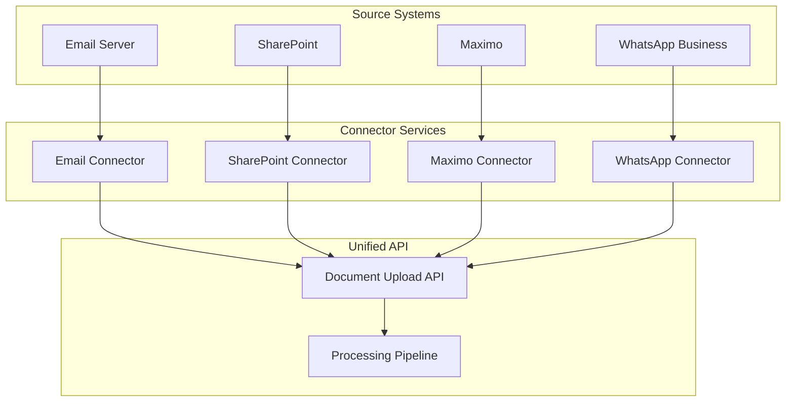

graph TB
    subgraph "Source Systems"
        A1[Email Server]
        A2[SharePoint]
        A3[Maximo]
        A4[WhatsApp Business]
    end
    
    subgraph "Connector Services"
        B1[Email Connector]
        B2[SharePoint Connector]
        B3[Maximo Connector]
        B4[WhatsApp Connector]
    end
    
    subgraph "Unified API"
        C[Document Upload API]
        D[Processing Pipeline]
    end
    
    A1 --> B1
    A2 --> B2
    A3 --> B3
    A4 --> B4
    
    B1 --> C
    B2 --> C
    B3 --> C
    B4 --> C
    
    C --> D


    I'll explain the connector services in technical detail, showing how they work to pull documents from various sources into your unified Document Upload API.


[1 tool called]

## Connector Services: Technical Deep Dive

Connector services are **background microservices** that act as bridges between KMRL's existing document sources and your unified Document Upload API. They continuously monitor source systems and automatically transfer documents.

## Architecture Overview



## How Connector Services Work

### **1. Polling Pattern (Most Common)**
Connectors periodically check source systems for new documents:

```python
# Base Connector Class
class BaseConnector:
    def __init__(self, source_name, api_endpoint):
        self.source_name = source_name
        self.api_endpoint = api_endpoint
        self.last_sync = None
        
    def sync_documents(self):
        """Main sync method - runs every 5-15 minutes"""
        new_documents = self.fetch_new_documents()
        for doc in new_documents:
            self.upload_to_api(doc)
        self.update_last_sync()
    
    def upload_to_api(self, document):
        """Upload document to unified API"""
        payload = {
            "file": document.file_data,
            "filename": document.filename,
            "source": self.source_name,
            "metadata": document.metadata,
            "uploaded_by": document.user_id
        }
        response = requests.post(f"{self.api_endpoint}/documents/upload", 
                               files=payload)
        return response.json()
```

### **2. Email Connector Implementation**

```python
class EmailConnector(BaseConnector):
    def __init__(self, imap_server, username, password):
        super().__init__("email", "http://api.kmrl.com")
        self.imap_server = imap_server
        self.username = username
        self.password = password
        
    def fetch_new_documents(self):
        """Fetch emails with attachments since last sync"""
        import imaplib
        import email
        
        mail = imaplib.IMAP4_SSL(self.imap_server)
        mail.login(self.username, self.password)
        mail.select('inbox')
        
        # Search for emails since last sync
        search_criteria = f'SINCE "{self.last_sync.strftime("%d-%b-%Y")}"'
        status, messages = mail.search(None, search_criteria)
        
        documents = []
        for msg_id in messages[0].split():
            status, msg_data = mail.fetch(msg_id, '(RFC822)')
            email_message = email.message_from_bytes(msg_data[0][1])
            
            # Extract attachments
            for part in email_message.walk():
                if part.get_content_disposition() == 'attachment':
                    filename = part.get_filename()
                    if filename and self.is_document_file(filename):
                        documents.append(Document(
                            file_data=part.get_payload(decode=True),
                            filename=filename,
                            metadata={
                                "sender": email_message.get("From"),
                                "subject": email_message.get("Subject"),
                                "date": email_message.get("Date"),
                                "source": "email"
                            }
                        ))
        
        mail.close()
        mail.logout()
        return documents
    
    def is_document_file(self, filename):
        """Check if file is a document type we process"""
        doc_extensions = ['.pdf', '.docx', '.doc', '.xlsx', '.pptx']
        return any(filename.lower().endswith(ext) for ext in doc_extensions)
```

### **3. SharePoint Connector Implementation**

```python
class SharePointConnector(BaseConnector):
    def __init__(self, site_url, client_id, client_secret):
        super().__init__("sharepoint", "http://api.kmrl.com")
        self.site_url = site_url
        self.client_id = client_id
        self.client_secret = client_secret
        self.access_token = None
        
    def authenticate(self):
        """Get OAuth2 access token"""
        auth_url = f"{self.site_url}/_api/contextinfo"
        response = requests.post(auth_url, 
                               data={"client_id": self.client_id,
                                    "client_secret": self.client_secret})
        self.access_token = response.json()["access_token"]
    
    def fetch_new_documents(self):
        """Fetch documents modified since last sync"""
        if not self.access_token:
            self.authenticate()
            
        # Query SharePoint REST API
        query_url = f"{self.site_url}/_api/web/lists/getbytitle('Documents')/items"
        params = {
            "$filter": f"Modified gt datetime'{self.last_sync.isoformat()}'",
            "$select": "Title,Modified,FileRef,FileLeafRef"
        }
        headers = {"Authorization": f"Bearer {self.access_token}"}
        
        response = requests.get(query_url, params=params, headers=headers)
        documents = []
        
        for item in response.json()["value"]:
            # Download the actual file
            file_url = f"{self.site_url}/_api/web/GetFileByServerRelativeUrl('{item['FileRef']}')/$value"
            file_response = requests.get(file_url, headers=headers)
            
            documents.append(Document(
                file_data=file_response.content,
                filename=item["FileLeafRef"],
                metadata={
                    "title": item["Title"],
                    "modified": item["Modified"],
                    "file_path": item["FileRef"],
                    "source": "sharepoint"
                }
            ))
        
        return documents
```

### **4. Maximo Connector Implementation**

```python
class MaximoConnector(BaseConnector):
    def __init__(self, maximo_url, username, password):
        super().__init__("maximo", "http://api.kmrl.com")
        self.maximo_url = maximo_url
        self.username = username
        self.password = password
        
    def fetch_new_documents(self):
        """Fetch exported documents from Maximo"""
        # Maximo typically exports to FTP/SFTP or provides REST API
        documents = []
        
        # Method 1: FTP Export Folder
        ftp_host = "maximo-export.kmrl.com"
        ftp = FTP(ftp_host)
        ftp.login(self.username, self.password)
        ftp.cwd("/exports/documents")
        
        file_list = ftp.nlst()
        for filename in file_list:
            if self.is_document_file(filename):
                # Download file
                with open(f"/tmp/{filename}", 'wb') as f:
                    ftp.retrbinary(f'RETR {filename}', f.write)
                
                with open(f"/tmp/{filename}", 'rb') as f:
                    file_data = f.read()
                
                documents.append(Document(
                    file_data=file_data,
                    filename=filename,
                    metadata={
                        "export_date": datetime.now().isoformat(),
                        "source": "maximo",
                        "export_type": "maintenance_docs"
                    }
                ))
                
                # Clean up temp file
                os.remove(f"/tmp/{filename}")
        
        ftp.quit()
        return documents
```

### **5. WhatsApp Business Connector**

```python
class WhatsAppConnector(BaseConnector):
    def __init__(self, whatsapp_api_token, phone_number_id):
        super().__init__("whatsapp", "http://api.kmrl.com")
        self.api_token = whatsapp_api_token
        self.phone_number_id = phone_number_id
        
    def fetch_new_documents(self):
        """Fetch documents from WhatsApp Business API"""
        url = f"https://graph.facebook.com/v17.0/{self.phone_number_id}/messages"
        headers = {"Authorization": f"Bearer {self.api_token}"}
        
        response = requests.get(url, headers=headers)
        documents = []
        
        for message in response.json()["data"]:
            if message.get("type") == "document":
                # Download document
                media_id = message["document"]["id"]
                media_url = f"https://graph.facebook.com/v17.0/{media_id}"
                media_response = requests.get(media_url, headers=headers)
                
                documents.append(Document(
                    file_data=media_response.content,
                    filename=message["document"]["filename"],
                    metadata={
                        "from": message["from"],
                        "timestamp": message["timestamp"],
                        "source": "whatsapp",
                        "message_id": message["id"]
                    }
                ))
        
        return documents
```

## Connector Service Deployment

### **Docker Container Setup**

```dockerfile
# Dockerfile for connector service
FROM python:3.9-slim

WORKDIR /app
COPY requirements.txt .
RUN pip install -r requirements.txt

COPY connectors/ .
COPY config/ .

CMD ["python", "connector_manager.py"]
```

### **Connector Manager**

```python
# connector_manager.py
import schedule
import time
from connectors import EmailConnector, SharePointConnector, MaximoConnector

class ConnectorManager:
    def __init__(self):
        self.connectors = [
            EmailConnector("imap.kmrl.com", "docs@kmrl.com", "password"),
            SharePointConnector("https://kmrl.sharepoint.com", "client_id", "secret"),
            MaximoConnector("https://maximo.kmrl.com", "user", "pass")
        ]
    
    def run_sync(self):
        """Run sync for all connectors"""
        for connector in self.connectors:
            try:
                print(f"Syncing {connector.source_name}...")
                connector.sync_documents()
                print(f"✓ {connector.source_name} sync completed")
            except Exception as e:
                print(f"✗ {connector.source_name} sync failed: {e}")
    
    def start(self):
        """Start scheduled sync"""
        schedule.every(10).minutes.do(self.run_sync)
        
        while True:
            schedule.run_pending()
            time.sleep(60)

if __name__ == "__main__":
    manager = ConnectorManager()
    manager.start()
```

## Key Technical Benefits

### **1. Decoupled Architecture**
- Each connector is independent
- Can be deployed separately
- Easy to add new sources

### **2. Fault Tolerance**
- If one connector fails, others continue
- Retry mechanisms for failed uploads
- Dead letter queues for problematic documents

### **3. Scalability**
- Horizontal scaling of connectors
- Rate limiting per source system
- Batch processing capabilities

### **4. Monitoring**
- Health checks for each connector
- Metrics on sync frequency and success rates
- Alerting for failed syncs


[1 tool called]

## Summary

Connector services are **automated background processes** that:

1. **Monitor** source systems (email, SharePoint, Maximo, WhatsApp)
2. **Extract** new documents using appropriate APIs/protocols
3. **Transform** documents into standardized format
4. **Upload** to your unified Document Upload API
5. **Track** sync status and handle failures

They run **every 5-15 minutes** and ensure all KMRL documents flow into your centralized system automatically, solving the "documents scattered everywhere" problem without manual intervention.