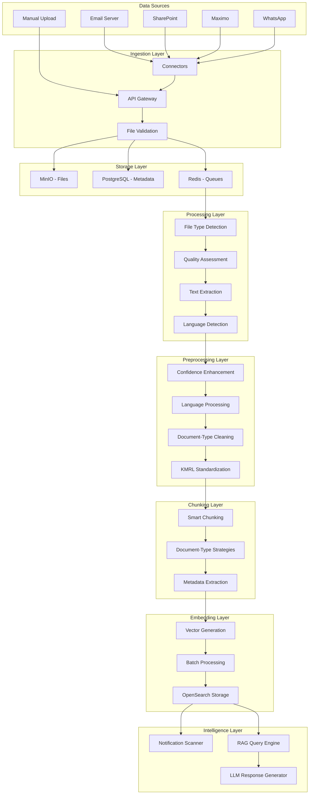

# KMRL Document Pipeline Research & Standardization

## Executive Summary

This document provides a comprehensive research analysis of the KMRL document processing pipeline, based on the problem statement, detailed flow specifications, and enhanced preprocessing requirements. It outlines a standardized approach for document processing from extraction through embedding generation, with a focus on the diverse document types and multilingual content specific to KMRL's operations.

## 1. Pipeline Flow Analysis

### 1.1 Document Types & Sources

Based on the problem statement, KMRL processes diverse document types:

**Document Categories:**
- **Engineering Documents**: Drawings, CAD files, technical specifications
- **Operational Documents**: Maintenance job cards, incident reports, safety circulars
- **Financial Documents**: Vendor invoices, purchase orders, budget reports
- **Regulatory Documents**: Compliance directives, legal opinions, board minutes
- **Administrative Documents**: HR policies, environmental studies

**Data Sources:**
- Email attachments (Gmail connector)
- SharePoint repositories
- Maximo exports
- WhatsApp PDFs
- Manual uploads
- Hard-copy scans

**Language Requirements:**
- English documents
- Malayalam documents
- Bilingual hybrid documents

### 1.2 Current Pipeline Flow

```
Document Sources → Connectors → API Gateway → Storage → Processing → RAG Pipeline → Intelligence Layer
```

**Detailed Flow:**
1. **Ingestion**: Documents collected via connectors or manual upload
2. **Validation**: File type, size, security scanning
3. **Storage**: MinIO for files, PostgreSQL for metadata, Redis for queues
4. **Processing**: File type detection, quality assessment, text extraction
5. **Preprocessing**: Language detection, translation, cleaning
6. **Chunking**: Document-type specific chunking strategies
7. **Embedding**: Vector generation and storage in OpenSearch
8. **Intelligence**: Notification scanning, RAG query processing

## 2. Document Processing Stages

### 2.1 Stage 1: Document Ingestion

**Input**: Raw documents from various sources
**Processing**:
- File validation (size, type, security)
- Authentication (API key or session)
- Initial metadata extraction

**Output Format**:
```json
{
  "document_id": "doc_12345",
  "original_filename": "maintenance_report_001.pdf",
  "source": "gmail_connector",
  "upload_timestamp": "2024-01-15T10:30:00Z",
  "file_size": 2048576,
  "file_type": "application/pdf",
  "validation_status": "passed",
  "security_scan": "clean",
  "document_category": "maintenance_card"
}
```

### 2.2 Stage 2: Document Processing

**Input**: Validated document files
**Processing**:
- File type detection
- Quality assessment
- Text extraction (Markitdown, OCR, CAD processing)
- Language detection
- Confidence scoring

#### 2.2.1 General Document Processing

**For all document types, initial processing includes**:
- File type detection (PDF, Office, Images, CAD, etc.)
- Basic quality assessment
- Text extraction using appropriate method
- Language detection (English, Malayalam, Mixed)
- Initial confidence scoring

**General Output Format**:
```json
{
  "document_id": "doc_12345",
  "extracted_text": "Raw extracted text with potential OCR errors",
  "document_type": "detected_type",
  "processing_method": "markitdown|tesseract|cad_processor",
  "language": "english|malayalam|mixed",
  "confidence_score": 0.85,
  "ocr_confidence": 0.92,
  "quality_metrics": {
    "text_density": 0.75,
    "ocr_error_ratio": 0.15,
    "meaningful_content_ratio": 0.80
  }
}
```

#### 2.2.2 Document-Type Specific Processing

**After general processing, documents are routed to specific processors based on detected type**:

**Engineering Drawings (.dwg, .dxf, .step, .stp, .iges, .igs)**:
```json
{
  "document_id": "eng_001",
  "extracted_text": "Technical drawing metadata and placeholder text",
  "document_type": "engineering_drawing",
  "processing_method": "cad_processor",
  "language": "english",
  "confidence_score": 0.90,
  "technical_metadata": {
    "drawing_number": "DWG-TM-001",
    "revision": "A",
    "scale": "1:10",
    "title": "Traction Motor Assembly",
    "material": "Cast Iron",
    "dimensions": "200x150x75mm"
  }
}
```

**Maintenance Cards (PDF forms)**:
```json
{
  "document_id": "maint_001",
  "extracted_text": "Maintenance procedures and safety requirements",
  "document_type": "maintenance_card",
  "processing_method": "markitdown",
  "language": "english",
  "confidence_score": 0.88,
  "maintenance_metadata": {
    "equipment_id": "TM-001",
    "inspection_type": "weekly",
    "scheduled_date": "2024-01-15",
    "department": "engineering",
    "safety_level": "high"
  }
}
```

**Incident Reports (PDF documents)**:
```json
{
  "document_id": "inc_001",
  "extracted_text": "Incident description, timeline, and corrective actions",
  "document_type": "incident_report",
  "processing_method": "markitdown",
  "language": "english",
  "confidence_score": 0.85,
  "incident_metadata": {
    "incident_id": "INC-2024-001",
    "severity": "medium",
    "location": "MG Road Station",
    "date_occurred": "2024-01-15T14:30:00Z",
    "reported_by": "station_controller_001",
    "status": "investigation"
  }
}
```

**Financial Documents (PDF invoices, Excel files)**:
```json
{
  "document_id": "fin_001",
  "extracted_text": "Invoice details, vendor information, and financial data",
  "document_type": "financial_document",
  "processing_method": "markitdown",
  "language": "english",
  "confidence_score": 0.92,
  "financial_metadata": {
    "invoice_number": "INV-ABC-001",
    "vendor": "ABC Bearings Ltd",
    "amount": 60000,
    "currency": "INR",
    "due_date": "2024-02-15",
    "payment_status": "pending"
  }
}
```

**Regulatory Documents (PDF compliance directives)**:
```json
{
  "document_id": "reg_001",
  "extracted_text": "Regulatory requirements and compliance directives",
  "document_type": "regulatory_document",
  "processing_method": "markitdown",
  "language": "english",
  "confidence_score": 0.90,
  "regulatory_metadata": {
    "authority": "CMRS",
    "directive_number": "CMRS-2024-001",
    "compliance_level": "mandatory",
    "effective_date": "2024-02-01",
    "department": "safety",
    "audit_required": true
  }
}
```

**Environmental Studies (PDF reports)**:
```json
{
  "document_id": "env_001",
  "extracted_text": "Environmental impact assessment and recommendations",
  "document_type": "environmental_study",
  "processing_method": "markitdown",
  "language": "english",
  "confidence_score": 0.87,
  "environmental_metadata": {
    "study_type": "impact_assessment",
    "phase": "phase2",
    "location": "Kochi Metro Corridor",
    "completion_date": "2024-01-10",
    "department": "environmental",
    "approval_status": "pending"
  }
}
```

**HR Policies (PDF policy documents)**:
```json
{
  "document_id": "hr_001",
  "extracted_text": "HR policy content and implementation guidelines",
  "document_type": "hr_policy",
  "processing_method": "markitdown",
  "language": "english",
  "confidence_score": 0.89,
  "hr_metadata": {
    "policy_type": "safety_training",
    "effective_date": "2024-01-01",
    "department": "hr",
    "approval_status": "approved",
    "review_date": "2024-12-31",
    "compliance_required": true
  }
}
```

**Board Meeting Minutes (PDF minutes)**:
```json
{
  "document_id": "board_001",
  "extracted_text": "Meeting minutes, decisions, and action items",
  "document_type": "board_minutes",
  "processing_method": "markitdown",
  "language": "english",
  "confidence_score": 0.86,
  "board_metadata": {
    "meeting_date": "2024-01-10",
    "meeting_type": "monthly_board",
    "agenda_items": 8,
    "decisions_made": 5,
    "department": "executive",
    "action_items": 3
  }
}
```

**Legal Opinions (PDF legal reviews)**:
```json
{
  "document_id": "legal_001",
  "extracted_text": "Legal opinion content and risk assessment",
  "document_type": "legal_opinion",
  "processing_method": "markitdown",
  "language": "english",
  "confidence_score": 0.91,
  "legal_metadata": {
    "opinion_type": "contract_review",
    "legal_counsel": "external_firm",
    "contract_value": 5000000,
    "risk_level": "low",
    "department": "legal",
    "approval_required": true
  }
}
```

**WhatsApp PDFs (Emergency procedures)**:
```json
{
  "document_id": "whatsapp_001",
  "extracted_text": "Emergency procedures and response guidelines",
  "document_type": "emergency_procedure",
  "processing_method": "markitdown",
  "language": "english",
  "confidence_score": 0.88,
  "whatsapp_metadata": {
    "sender": "station_manager_001",
    "group": "emergency_response",
    "message_type": "document_share",
    "priority": "high",
    "department": "operations",
    "response_time": "immediate"
  }
}
```

**Hard-copy Scans (PDF scanned documents)**:
```json
{
  "document_id": "scan_001",
  "extracted_text": "Scanned document content with OCR processing",
  "document_type": "scanned_document",
  "processing_method": "tesseract",
  "language": "english",
  "confidence_score": 0.82,
  "scan_metadata": {
    "scan_quality": "high",
    "original_source": "hard_copy_manual",
    "scan_date": "2024-01-15",
    "scanner_type": "office_scanner",
    "department": "documentation",
    "ocr_confidence": 0.85
  }
}
```

## 3. Storage Architecture & Final JSON Structure

### 3.1 Storage System Design

**PostgreSQL Storage**:
- **Primary Key**: `document_id` (UUID) - unique across all documents
- **JSON Column**: Store complete document metadata and content as JSON
- **Indexing**: On document_type, source, upload_timestamp, department
- **Relationships**: Link to users, processing status, error logs

**MinIO Storage**:
- **File Path**: `{document_id}/{original_filename}`
- **Metadata**: Store file metadata in MinIO object metadata
- **Versioning**: Keep original files for audit and reprocessing
- **Access**: Direct file access via document_id

**Redis Storage**:
- **Processing Queue**: Store processing status and progress
- **Cache**: Store frequently accessed document metadata
- **Session Data**: User sessions and temporary data

### 3.2 Final JSON Structure After Complete Processing

**PostgreSQL JSON Column Structure**:
```json
{
  "document_id": "uuid",
  "storage_metadata": {
    "minio_path": "doc_12345/maintenance_report_001.pdf",
    "postgres_id": "uuid",
    "redis_key": "processing:doc_12345",
    "created_at": "2024-01-15T10:30:00Z",
    "updated_at": "2024-01-15T10:35:00Z"
  },
  "document_metadata": {
    "original_filename": "maintenance_report_001.pdf",
    "source": "gmail_connector",
    "upload_timestamp": "2024-01-15T10:30:00Z",
    "file_size": 2048576,
    "file_type": "application/pdf",
    "validation_status": "passed",
    "security_scan": "clean",
    "document_category": "maintenance_card"
  },
  "processing_metadata": {
    "document_type": "maintenance_card",
    "processing_method": "markitdown",
    "language": "english",
    "confidence_score": 0.88,
    "ocr_confidence": 0.92,
    "quality_metrics": {
      "text_density": 0.75,
      "ocr_error_ratio": 0.15,
      "meaningful_content_ratio": 0.80
    }
  },
  "preprocessing_metadata": {
    "preprocessing_applied": true,
    "language_info": {
      "original_language": "english",
      "translation_applied": false,
      "translation_confidence": null
    },
    "quality_scores": {
      "text_length": 1250,
      "word_count": 180,
      "confidence_score": 0.88
    }
  },
  "content": {
    "raw_text": "Raw extracted text with potential OCR errors",
    "preprocessed_text": "Clean, standardized text ready for chunking",
    "chunks": [
      {
        "chunk_id": "doc_12345_chunk_001",
        "content": "Maintenance Schedule: Weekly inspection of traction motors required.",
        "chunk_type": "maintenance_schedule",
        "metadata": {
          "section": "safety_requirements",
          "confidence_score": 0.92,
          "word_count": 25,
          "language": "english"
        }
      }
    ]
  },
  "embeddings": [
    {
      "chunk_id": "doc_12345_chunk_001",
      "embedding_vector": [0.1234, -0.5678, 0.9012],
      "embedding_model": "text-embedding-3-large",
      "dimension": 3072,
      "generation_timestamp": "2024-01-15T10:35:00Z",
      "document_id": "doc_12345",
      "source_metadata": {
        "original_filename": "maintenance_report_001.pdf",
        "source": "gmail_connector",
        "document_type": "maintenance_card",
        "upload_timestamp": "2024-01-15T10:30:00Z",
        "department": "engineering"
      }
    }
  ],
  "rag_metadata": {
    "chunking_strategy": "section_based",
    "total_chunks": 15,
    "chunking_metadata": {
      "strategy_used": "maintenance_document_chunker",
      "overlap_sentences": 1,
      "average_chunk_size": 3.2
    },
    "embedding_metadata": {
      "model_version": "text-embedding-3-large",
      "total_vectors": 15,
      "processing_time": "2.3s",
      "batch_size": 5
    }
  },
  "status": {
    "processing_stage": "completed",
    "completion_status": "success",
    "error_log": []
  }
}
```

### 3.3 Document-Type Specific Final JSON Structures

**Engineering Drawings Final JSON**:
```json
{
  "document_id": "eng_001",
  "storage_metadata": {
    "minio_path": "eng_001/traction_motor_drawing_001.dwg",
    "postgres_id": "uuid",
    "redis_key": "processing:eng_001",
    "created_at": "2024-01-15T10:30:00Z",
    "updated_at": "2024-01-15T10:35:00Z"
  },
  "document_metadata": {
    "original_filename": "traction_motor_drawing_001.dwg",
    "source": "sharepoint_connector",
    "upload_timestamp": "2024-01-15T10:30:00Z",
    "file_size": 5242880,
    "file_type": "application/dwg",
    "validation_status": "passed",
    "security_scan": "clean",
    "document_category": "engineering_drawing"
  },
  "processing_metadata": {
    "document_type": "engineering_drawing",
    "processing_method": "cad_processor",
    "language": "english",
    "confidence_score": 0.90,
    "ocr_confidence": null,
    "quality_metrics": {
      "text_density": 0.85,
      "ocr_error_ratio": 0.0,
      "meaningful_content_ratio": 0.90
    }
  },
  "technical_metadata": {
    "drawing_number": "DWG-TM-001",
    "revision": "A",
    "scale": "1:10",
    "title": "Traction Motor Assembly",
    "material": "Cast Iron",
    "dimensions": "200x150x75mm",
    "engineer": "John Smith",
    "approval_status": "approved",
    "department": "engineering"
  },
  "content": {
    "raw_text": "Technical drawing metadata and placeholder text",
    "preprocessed_text": "Drawing DWG-TM-001 Rev A: Main bearing housing, Material: Cast Iron, Dimensions: 200x150x75mm",
    "chunks": [
      {
        "chunk_id": "eng_001_chunk_001",
        "content": "Drawing DWG-TM-001 Rev A: Main bearing housing, Material: Cast Iron, Dimensions: 200x150x75mm",
        "chunk_type": "technical_specification",
        "metadata": {
          "section": "drawing_info",
          "confidence_score": 0.95,
          "word_count": 15,
          "language": "english"
        }
      }
    ]
  },
  "embeddings": [
    {
      "chunk_id": "eng_001_chunk_001",
      "embedding_vector": [0.1234, -0.5678, 0.9012],
      "embedding_model": "text-embedding-3-large",
      "dimension": 3072,
      "generation_timestamp": "2024-01-15T10:35:00Z"
    }
  ],
  "rag_metadata": {
    "chunking_strategy": "metadata_based",
    "total_chunks": 1,
    "chunking_metadata": {
      "strategy_used": "engineering_drawing_chunker",
      "overlap_sentences": 0,
      "average_chunk_size": 1.0
    }
  },
  "status": {
    "processing_stage": "completed",
    "completion_status": "success",
    "error_log": []
  }
}
```

**Maintenance Cards Final JSON**:
```json
{
  "document_id": "maint_001",
  "storage_metadata": {
    "minio_path": "maint_001/weekly_inspection_card_001.pdf",
    "postgres_id": "uuid",
    "redis_key": "processing:maint_001",
    "created_at": "2024-01-15T10:30:00Z",
    "updated_at": "2024-01-15T10:35:00Z"
  },
  "document_metadata": {
    "original_filename": "weekly_inspection_card_001.pdf",
    "source": "gmail_connector",
    "upload_timestamp": "2024-01-15T10:30:00Z",
    "file_size": 2048576,
    "file_type": "application/pdf",
    "validation_status": "passed",
    "security_scan": "clean",
    "document_category": "maintenance_card"
  },
  "processing_metadata": {
    "document_type": "maintenance_card",
    "processing_method": "markitdown",
    "language": "english",
    "confidence_score": 0.88,
    "ocr_confidence": 0.92,
    "quality_metrics": {
      "text_density": 0.75,
      "ocr_error_ratio": 0.15,
      "meaningful_content_ratio": 0.80
    }
  },
  "maintenance_metadata": {
    "equipment_id": "TM-001",
    "inspection_type": "weekly",
    "scheduled_date": "2024-01-15",
    "department": "engineering",
    "safety_level": "high",
    "inspector": "John Doe",
    "completion_status": "pending",
    "next_inspection": "2024-01-22"
  },
  "content": {
    "raw_text": "Maintenance procedures and safety requirements",
    "preprocessed_text": "Weekly Inspection Card: Equipment TM-001, Safety procedures must be followed during maintenance work.",
    "chunks": [
      {
        "chunk_id": "maint_001_chunk_001",
        "content": "Safety Requirements: Lockout/tagout procedures must be followed. Personal protective equipment required: safety glasses, hard hat, steel-toed boots.",
        "chunk_type": "safety_requirements",
        "metadata": {
          "section": "safety_requirements",
          "confidence_score": 0.92,
          "word_count": 25,
          "language": "english"
        }
      },
      {
        "chunk_id": "maint_001_chunk_002",
        "content": "Inspection Steps: 1. Check motor temperature 2. Inspect bearings 3. Test electrical connections 4. Verify safety systems.",
        "chunk_type": "inspection_steps",
        "metadata": {
          "section": "inspection_procedures",
          "confidence_score": 0.88,
          "word_count": 20,
          "language": "english"
        }
      }
    ]
  },
  "embeddings": [
    {
      "chunk_id": "maint_001_chunk_001",
      "embedding_vector": [0.1234, -0.5678, 0.9012],
      "embedding_model": "text-embedding-3-large",
      "dimension": 3072,
      "generation_timestamp": "2024-01-15T10:35:00Z"
    },
    {
      "chunk_id": "maint_001_chunk_002",
      "embedding_vector": [0.2345, -0.6789, 0.0123],
      "embedding_model": "text-embedding-3-large",
      "dimension": 3072,
      "generation_timestamp": "2024-01-15T10:35:00Z"
    }
  ],
  "rag_metadata": {
    "chunking_strategy": "section_based",
    "total_chunks": 2,
    "chunking_metadata": {
      "strategy_used": "maintenance_document_chunker",
      "overlap_sentences": 1,
      "average_chunk_size": 2.5
    }
  },
  "status": {
    "processing_stage": "completed",
    "completion_status": "success",
    "error_log": []
  }
}
```

**Incident Reports Final JSON**:
```json
{
  "document_id": "inc_001",
  "storage_metadata": {
    "minio_path": "inc_001/signal_failure_incident_001.pdf",
    "postgres_id": "uuid",
    "redis_key": "processing:inc_001",
    "created_at": "2024-01-15T10:30:00Z",
    "updated_at": "2024-01-15T10:35:00Z"
  },
  "document_metadata": {
    "original_filename": "signal_failure_incident_001.pdf",
    "source": "manual_upload",
    "upload_timestamp": "2024-01-15T10:30:00Z",
    "file_size": 1536000,
    "file_type": "application/pdf",
    "validation_status": "passed",
    "security_scan": "clean",
    "document_category": "incident_report"
  },
  "processing_metadata": {
    "document_type": "incident_report",
    "processing_method": "markitdown",
    "language": "english",
    "confidence_score": 0.85,
    "ocr_confidence": 0.90,
    "quality_metrics": {
      "text_density": 0.80,
      "ocr_error_ratio": 0.10,
      "meaningful_content_ratio": 0.85
    }
  },
  "incident_metadata": {
    "incident_id": "INC-2024-001",
    "severity": "medium",
    "location": "MG Road Station",
    "date_occurred": "2024-01-15T14:30:00Z",
    "reported_by": "station_controller_001",
    "status": "investigation",
    "affected_systems": ["signaling", "train_control"],
    "estimated_delay": "15 minutes",
    "passengers_affected": 150
  },
  "content": {
    "raw_text": "Incident description, timeline, and corrective actions",
    "preprocessed_text": "Signal Failure Incident: MG Road Station, 14:30 - Signal failure detected, 14:35 - Manual signal operation initiated, 14:45 - Train service restored.",
    "chunks": [
      {
        "chunk_id": "inc_001_chunk_001",
        "content": "Timeline: 14:30 - Signal failure detected at MG Road station. 14:35 - Manual signal operation initiated. 14:45 - Train service restored with 15-minute delay.",
        "chunk_type": "incident_timeline",
        "metadata": {
          "section": "timeline",
          "confidence_score": 0.90,
          "word_count": 30,
          "language": "english"
        }
      },
      {
        "chunk_id": "inc_001_chunk_002",
        "content": "Root Cause: Electrical fault in signal control system. Corrective Action: Replace faulty control module, implement backup system.",
        "chunk_type": "root_cause_analysis",
        "metadata": {
          "section": "analysis",
          "confidence_score": 0.85,
          "word_count": 25,
          "language": "english"
        }
      }
    ]
  },
  "embeddings": [
    {
      "chunk_id": "inc_001_chunk_001",
      "embedding_vector": [0.1234, -0.5678, 0.9012],
      "embedding_model": "text-embedding-3-large",
      "dimension": 3072,
      "generation_timestamp": "2024-01-15T10:35:00Z"
    },
    {
      "chunk_id": "inc_001_chunk_002",
      "embedding_vector": [0.2345, -0.6789, 0.0123],
      "embedding_model": "text-embedding-3-large",
      "dimension": 3072,
      "generation_timestamp": "2024-01-15T10:35:00Z"
    }
  ],
  "rag_metadata": {
    "chunking_strategy": "event_based",
    "total_chunks": 2,
    "chunking_metadata": {
      "strategy_used": "incident_report_chunker",
      "overlap_sentences": 2,
      "average_chunk_size": 3.5
    }
  },
  "status": {
    "processing_stage": "completed",
    "completion_status": "success",
    "error_log": []
  }
}
```

**Financial Documents Final JSON**:
```json
{
  "document_id": "fin_001",
  "storage_metadata": {
    "minio_path": "fin_001/vendor_invoice_abc_bearings_001.pdf",
    "postgres_id": "uuid",
    "redis_key": "processing:fin_001",
    "created_at": "2024-01-15T10:30:00Z",
    "updated_at": "2024-01-15T10:35:00Z"
  },
  "document_metadata": {
    "original_filename": "vendor_invoice_abc_bearings_001.pdf",
    "source": "gmail_connector",
    "upload_timestamp": "2024-01-15T10:30:00Z",
    "file_size": 1024000,
    "file_type": "application/pdf",
    "validation_status": "passed",
    "security_scan": "clean",
    "document_category": "financial_document"
  },
  "processing_metadata": {
    "document_type": "financial_document",
    "processing_method": "markitdown",
    "language": "english",
    "confidence_score": 0.92,
    "ocr_confidence": 0.95,
    "quality_metrics": {
      "text_density": 0.85,
      "ocr_error_ratio": 0.05,
      "meaningful_content_ratio": 0.90
    }
  },
  "financial_metadata": {
    "invoice_number": "INV-ABC-001",
    "vendor": "ABC Bearings Ltd",
    "amount": 60000,
    "currency": "INR",
    "due_date": "2024-02-15",
    "payment_status": "pending",
    "purchase_order": "PO-2024-001",
    "tax_amount": 10800,
    "net_amount": 49200
  },
  "content": {
    "raw_text": "Invoice details, vendor information, and financial data",
    "preprocessed_text": "Invoice INV-ABC-001: Item: Traction Motor Bearings, Quantity: 4, Unit Price: ₹15,000, Total: ₹60,000, Vendor: ABC Bearings Ltd",
    "chunks": [
      {
        "chunk_id": "fin_001_chunk_001",
        "content": "Invoice INV-ABC-001: Item: Traction Motor Bearings, Quantity: 4, Unit Price: ₹15,000, Total: ₹60,000, Vendor: ABC Bearings Ltd",
        "chunk_type": "invoice_line_item",
        "metadata": {
          "section": "line_items",
          "confidence_score": 0.95,
          "word_count": 20,
          "language": "english"
        }
      },
      {
        "chunk_id": "fin_001_chunk_002",
        "content": "Payment Terms: Net 30 days, Due Date: 2024-02-15, Payment Method: Bank Transfer, Tax: 18% GST",
        "chunk_type": "payment_terms",
        "metadata": {
          "section": "payment_info",
          "confidence_score": 0.90,
          "word_count": 18,
          "language": "english"
        }
      }
    ]
  },
  "embeddings": [
    {
      "chunk_id": "fin_001_chunk_001",
      "embedding_vector": [0.1234, -0.5678, 0.9012],
      "embedding_model": "text-embedding-3-large",
      "dimension": 3072,
      "generation_timestamp": "2024-01-15T10:35:00Z"
    },
    {
      "chunk_id": "fin_001_chunk_002",
      "embedding_vector": [0.2345, -0.6789, 0.0123],
      "embedding_model": "text-embedding-3-large",
      "dimension": 3072,
      "generation_timestamp": "2024-01-15T10:35:00Z"
    }
  ],
  "rag_metadata": {
    "chunking_strategy": "table_based",
    "total_chunks": 2,
    "chunking_metadata": {
      "strategy_used": "financial_document_chunker",
      "overlap_sentences": 0,
      "average_chunk_size": 2.0
    }
  },
  "status": {
    "processing_stage": "completed",
    "completion_status": "success",
    "error_log": []
  }
}
```

## 4. RAG Traceability & Document Citation System

### 4.1 Embedding Storage with Document Traceability

**OpenSearch/Vector Database Structure**:
```json
{
  "chunk_id": "doc_12345_chunk_001",
  "embedding_vector": [0.1234, -0.5678, 0.9012, ...],
  "document_id": "doc_12345",
  "chunk_content": "Maintenance Schedule: Weekly inspection of traction motors required.",
  "chunk_metadata": {
    "section": "safety_requirements",
    "confidence_score": 0.92,
    "word_count": 25,
    "language": "english",
    "chunk_type": "maintenance_schedule"
  },
  "source_metadata": {
    "original_filename": "maintenance_report_001.pdf",
    "source": "gmail_connector",
    "document_type": "maintenance_card",
    "upload_timestamp": "2024-01-15T10:30:00Z",
    "department": "engineering",
    "file_size": 2048576,
    "file_type": "application/pdf"
  },
  "processing_metadata": {
    "processing_method": "markitdown",
    "language": "english",
    "confidence_score": 0.88,
    "ocr_confidence": 0.92
  },
  "rag_metadata": {
    "chunking_strategy": "section_based",
    "chunk_position": 1,
    "total_chunks": 15,
    "embedding_model": "text-embedding-3-large",
    "generation_timestamp": "2024-01-15T10:35:00Z"
  }
}
```

### 4.2 RAG Query Response with Citations

**Query**: "What are the safety requirements for traction motor maintenance?"

**RAG Response Structure**:
```json
{
  "query": "What are the safety requirements for traction motor maintenance?",
  "response": "According to the maintenance procedures, safety requirements for traction motor maintenance include: 1. Lockout/tagout procedures must be followed, 2. Personal protective equipment required: safety glasses, hard hat, steel-toed boots, 3. Weekly inspection of traction motors is required.",
  "sources": [
    {
      "chunk_id": "doc_12345_chunk_001",
      "document_id": "doc_12345",
      "content": "Safety Requirements: Lockout/tagout procedures must be followed. Personal protective equipment required: safety glasses, hard hat, steel-toed boots.",
      "relevance_score": 0.95,
      "source_metadata": {
        "original_filename": "maintenance_report_001.pdf",
        "source": "gmail_connector",
        "document_type": "maintenance_card",
        "upload_timestamp": "2024-01-15T10:30:00Z",
        "department": "engineering"
      },
      "chunk_metadata": {
        "section": "safety_requirements",
        "confidence_score": 0.92,
        "word_count": 25,
        "language": "english"
      }
    },
    {
      "chunk_id": "doc_12345_chunk_002",
      "document_id": "doc_12345",
      "content": "Inspection Schedule: Weekly inspection of traction motors required. Check motor temperature, inspect bearings, test electrical connections.",
      "relevance_score": 0.88,
      "source_metadata": {
        "original_filename": "maintenance_report_001.pdf",
        "source": "gmail_connector",
        "document_type": "maintenance_card",
        "upload_timestamp": "2024-01-15T10:30:00Z",
        "department": "engineering"
      },
      "chunk_metadata": {
        "section": "inspection_procedures",
        "confidence_score": 0.88,
        "word_count": 20,
        "language": "english"
      }
    }
  ],
  "metadata": {
    "total_sources": 2,
    "average_relevance": 0.915,
    "processing_time": "0.5s",
    "model_used": "text-embedding-3-large"
  }
}
```

### 4.3 Document Citation Implementation

**Frontend Citation Display**:
```json
{
  "citations": [
    {
      "id": "citation_001",
      "text": "Safety Requirements: Lockout/tagout procedures must be followed...",
      "source": {
        "document_title": "maintenance_report_001.pdf",
        "document_type": "Maintenance Card",
        "source": "Gmail Connector",
        "department": "Engineering",
        "date": "2024-01-15",
        "page_section": "Safety Requirements"
      },
      "relevance_score": 0.95,
      "chunk_id": "doc_12345_chunk_001"
    }
  ]
}
```

### 4.4 Document Traceability Flow

**1. Document Ingestion**:
```json
{
  "document_id": "doc_12345",
  "original_filename": "maintenance_report_001.pdf",
  "source": "gmail_connector",
  "upload_timestamp": "2024-01-15T10:30:00Z"
}
```

**2. Processing & Chunking**:
```json
{
  "chunks": [
    {
      "chunk_id": "doc_12345_chunk_001",
      "content": "Safety Requirements: Lockout/tagout procedures must be followed...",
      "document_id": "doc_12345",
      "chunk_position": 1,
      "total_chunks": 15
    }
  ]
}
```

**3. Embedding Generation**:
```json
{
  "embeddings": [
    {
      "chunk_id": "doc_12345_chunk_001",
      "embedding_vector": [0.1234, -0.5678, 0.9012, ...],
      "document_id": "doc_12345",
      "source_metadata": {
        "original_filename": "maintenance_report_001.pdf",
        "source": "gmail_connector",
        "document_type": "maintenance_card",
        "department": "engineering"
      }
    }
  ]
}
```

**4. RAG Query Processing**:
```json
{
  "query": "safety requirements traction motor",
  "retrieved_chunks": [
    {
      "chunk_id": "doc_12345_chunk_001",
      "content": "Safety Requirements: Lockout/tagout procedures must be followed...",
      "relevance_score": 0.95,
      "document_id": "doc_12345",
      "source_metadata": {
        "original_filename": "maintenance_report_001.pdf",
        "source": "gmail_connector",
        "document_type": "maintenance_card",
        "department": "engineering"
      }
    }
  ]
}
```

### 4.5 Document Type Specific Citations

**Engineering Drawings Citation**:
```json
{
  "source": {
    "document_title": "traction_motor_drawing_001.dwg",
    "document_type": "Engineering Drawing",
    "source": "SharePoint Connector",
    "department": "Engineering",
    "date": "2024-01-15",
    "technical_info": {
      "drawing_number": "DWG-TM-001",
      "revision": "A",
      "scale": "1:10",
      "title": "Traction Motor Assembly"
    }
  }
}
```

**Incident Reports Citation**:
```json
{
  "source": {
    "document_title": "signal_failure_incident_001.pdf",
    "document_type": "Incident Report",
    "source": "Manual Upload",
    "department": "Operations",
    "date": "2024-01-15",
    "incident_info": {
      "incident_id": "INC-2024-001",
      "severity": "medium",
      "location": "MG Road Station",
      "status": "investigation"
    }
  }
}
```

**Financial Documents Citation**:
```json
{
  "source": {
    "document_title": "vendor_invoice_abc_bearings_001.pdf",
    "document_type": "Financial Document",
    "source": "Gmail Connector",
    "department": "Finance",
    "date": "2024-01-15",
    "financial_info": {
      "invoice_number": "INV-ABC-001",
      "vendor": "ABC Bearings Ltd",
      "amount": 60000,
      "currency": "INR",
      "due_date": "2024-02-15"
    }
  }
}
```

### 4.6 Implementation Requirements

**1. OpenSearch Index Mapping**:
```json
{
  "mappings": {
    "properties": {
      "chunk_id": {"type": "keyword"},
      "document_id": {"type": "keyword"},
      "embedding_vector": {"type": "dense_vector", "dims": 3072},
      "chunk_content": {"type": "text"},
      "source_metadata": {
        "properties": {
          "original_filename": {"type": "keyword"},
          "source": {"type": "keyword"},
          "document_type": {"type": "keyword"},
          "department": {"type": "keyword"},
          "upload_timestamp": {"type": "date"}
        }
      },
      "chunk_metadata": {
        "properties": {
          "section": {"type": "keyword"},
          "confidence_score": {"type": "float"},
          "word_count": {"type": "integer"},
          "language": {"type": "keyword"}
        }
      }
    }
  }
}
```

**2. RAG Query Processing**:
```python
def process_rag_query(query: str) -> dict:
    # 1. Convert query to embedding
    query_embedding = generate_embedding(query)
    
    # 2. Search OpenSearch for similar chunks
    search_results = opensearch.search({
        "query": {
            "knn": {
                "field": "embedding_vector",
                "query_vector": query_embedding,
                "k": 10
            }
        }
    })
    
    # 3. Extract document traceability info
    sources = []
    for hit in search_results['hits']['hits']:
        source = {
            "chunk_id": hit['_source']['chunk_id'],
            "document_id": hit['_source']['document_id'],
            "content": hit['_source']['chunk_content'],
            "relevance_score": hit['_score'],
            "source_metadata": hit['_source']['source_metadata'],
            "chunk_metadata": hit['_source']['chunk_metadata']
        }
        sources.append(source)
    
    # 4. Generate response with citations
    response = generate_llm_response(query, sources)
    
    return {
        "query": query,
        "response": response,
        "sources": sources,
        "metadata": {
            "total_sources": len(sources),
            "average_relevance": sum(s['relevance_score'] for s in sources) / len(sources)
        }
    }
```

## 5. Document Type Recognition & Classification

### 5.1 Document Classification Methods

**Multi-Layer Classification Approach**:

#### **Layer 1: File Extension & MIME Type Detection**
```python
def detect_file_type(filename: str, mime_type: str) -> str:
    """Detect document type based on file extension and MIME type"""
    
    # File extension mapping
    extension_mapping = {
        '.dwg': 'engineering_drawing',
        '.dxf': 'engineering_drawing', 
        '.step': 'engineering_drawing',
        '.stp': 'engineering_drawing',
        '.iges': 'engineering_drawing',
        '.igs': 'engineering_drawing',
        '.pdf': 'unknown',  # Need content analysis
        '.docx': 'unknown',  # Need content analysis
        '.doc': 'unknown',   # Need content analysis
        '.xlsx': 'financial_document',  # Likely financial
        '.xls': 'financial_document',   # Likely financial
        '.pptx': 'unknown',  # Need content analysis
        '.ppt': 'unknown',   # Need content analysis
        '.txt': 'unknown',   # Need content analysis
        '.jpg': 'unknown',   # Need OCR analysis
        '.png': 'unknown',   # Need OCR analysis
        '.tiff': 'unknown'   # Need OCR analysis
    }
    
    file_ext = Path(filename).suffix.lower()
    return extension_mapping.get(file_ext, 'unknown')
```

#### **Layer 2: Filename Pattern Recognition**
```python
def classify_by_filename(filename: str) -> str:
    """Classify document type based on filename patterns"""
    
    filename_lower = filename.lower()
    
    # Maintenance document patterns
    maintenance_patterns = [
        'maintenance', 'inspection', 'checklist', 'schedule', 'repair',
        'service', 'overhaul', 'preventive', 'corrective', 'routine',
        'weekly', 'monthly', 'annual', 'card', 'form', 'procedure'
    ]
    
    # Incident report patterns
    incident_patterns = [
        'incident', 'accident', 'failure', 'breakdown', 'malfunction',
        'emergency', 'urgent', 'critical', 'safety', 'report', 'investigation',
        'analysis', 'root_cause', 'corrective_action'
    ]
    
    # Financial document patterns
    financial_patterns = [
        'invoice', 'bill', 'payment', 'receipt', 'purchase', 'order',
        'budget', 'cost', 'expense', 'financial', 'accounting', 'audit',
        'vendor', 'supplier', 'contract', 'agreement', 'quotation'
    ]
    
    # Engineering drawing patterns
    engineering_patterns = [
        'drawing', 'dwg', 'cad', 'blueprint', 'technical', 'specification',
        'assembly', 'component', 'part', 'design', 'engineering', 'mechanical',
        'electrical', 'civil', 'structural'
    ]
    
    # Regulatory document patterns
    regulatory_patterns = [
        'regulation', 'compliance', 'directive', 'policy', 'procedure',
        'standard', 'requirement', 'mandatory', 'legal', 'audit', 'inspection',
        'certification', 'approval', 'authority'
    ]
    
    # Check patterns
    if any(pattern in filename_lower for pattern in maintenance_patterns):
        return 'maintenance_card'
    elif any(pattern in filename_lower for pattern in incident_patterns):
        return 'incident_report'
    elif any(pattern in filename_lower for pattern in financial_patterns):
        return 'financial_document'
    elif any(pattern in filename_lower for pattern in engineering_patterns):
        return 'engineering_drawing'
    elif any(pattern in filename_lower for pattern in regulatory_patterns):
        return 'regulatory_document'
    
    return 'unknown'
```

#### **Layer 3: Content-Based Classification**
```python
def classify_by_content(text: str, filename: str) -> str:
    """Classify document type based on content analysis"""
    
    # Maintenance document keywords
    maintenance_keywords = [
        'inspection', 'maintenance', 'safety', 'equipment', 'procedure',
        'checklist', 'schedule', 'repair', 'service', 'overhaul',
        'preventive', 'corrective', 'routine', 'weekly', 'monthly',
        'lockout', 'tagout', 'ppe', 'personal protective equipment'
    ]
    
    # Incident report keywords
    incident_keywords = [
        'incident', 'accident', 'failure', 'breakdown', 'malfunction',
        'emergency', 'urgent', 'critical', 'safety', 'investigation',
        'root cause', 'corrective action', 'timeline', 'severity',
        'location', 'reported by', 'affected systems', 'passengers'
    ]
    
    # Financial document keywords
    financial_keywords = [
        'invoice', 'bill', 'payment', 'receipt', 'purchase order',
        'budget', 'cost', 'expense', 'financial', 'accounting',
        'vendor', 'supplier', 'contract', 'agreement', 'quotation',
        'amount', 'currency', 'due date', 'payment terms', 'tax'
    ]
    
    # Engineering drawing keywords
    engineering_keywords = [
        'drawing', 'cad', 'blueprint', 'technical', 'specification',
        'assembly', 'component', 'part', 'design', 'engineering',
        'mechanical', 'electrical', 'civil', 'structural', 'dimensions',
        'material', 'scale', 'revision', 'title block'
    ]
    
    # Regulatory document keywords
    regulatory_keywords = [
        'regulation', 'compliance', 'directive', 'policy', 'procedure',
        'standard', 'requirement', 'mandatory', 'legal', 'audit',
        'certification', 'approval', 'authority', 'ministry', 'commissioner'
    ]
    
    text_lower = text.lower()
    
    # Count keyword matches
    maintenance_score = sum(1 for keyword in maintenance_keywords if keyword in text_lower)
    incident_score = sum(1 for keyword in incident_keywords if keyword in text_lower)
    financial_score = sum(1 for keyword in financial_keywords if keyword in text_lower)
    engineering_score = sum(1 for keyword in engineering_keywords if keyword in text_lower)
    regulatory_score = sum(1 for keyword in regulatory_keywords if keyword in text_lower)
    
    # Return highest scoring category
    scores = {
        'maintenance_card': maintenance_score,
        'incident_report': incident_score,
        'financial_document': financial_score,
        'engineering_drawing': engineering_score,
        'regulatory_document': regulatory_score
    }
    
    max_score = max(scores.values())
    if max_score > 0:
        return max(scores, key=scores.get)
    
    return 'general_document'
```

#### **Layer 4: ML-Based Classification**
```python
def classify_with_ml(text: str, filename: str) -> str:
    """Use machine learning model for document classification"""
    
    # Features for ML model
    features = {
        'filename': filename,
        'text_length': len(text),
        'word_count': len(text.split()),
        'has_numbers': bool(re.search(r'\d+', text)),
        'has_dates': bool(re.search(r'\d{1,2}[/-]\d{1,2}[/-]\d{2,4}', text)),
        'has_amounts': bool(re.search(r'₹\d+|INR\s*\d+|\d+\s*rupees', text)),
        'has_technical_terms': bool(re.search(r'(drawing|cad|blueprint|technical)', text.lower())),
        'has_safety_terms': bool(re.search(r'(safety|ppe|lockout|tagout)', text.lower())),
        'has_financial_terms': bool(re.search(r'(invoice|payment|budget|cost)', text.lower())),
        'has_incident_terms': bool(re.search(r'(incident|accident|failure|emergency)', text.lower()))
    }
    
    # Load pre-trained model (example)
    model = load_model('document_classifier.pkl')
    prediction = model.predict([features])
    
    return prediction[0]
```

### 5.2 Document Classification Pipeline

```python
def classify_document(document_data: dict) -> dict:
    """Complete document classification pipeline"""
    
    filename = document_data.get('original_filename', '')
    text = document_data.get('extracted_text', '')
    file_type = document_data.get('file_type', '')
    
    # Layer 1: File extension detection
    extension_type = detect_file_type(filename, file_type)
    
    # Layer 2: Filename pattern recognition
    filename_type = classify_by_filename(filename)
    
    # Layer 3: Content-based classification
    content_type = classify_by_content(text, filename)
    
    # Layer 4: ML-based classification (if available)
    ml_type = classify_with_ml(text, filename)
    
    # Combine results with confidence scoring
    classification_results = {
        'extension_based': extension_type,
        'filename_based': filename_type,
        'content_based': content_type,
        'ml_based': ml_type
    }
    
    # Determine final classification
    final_classification = determine_final_type(classification_results)
    
    return {
        'document_type': final_classification,
        'classification_method': 'multi_layer',
        'confidence_score': calculate_confidence(classification_results),
        'classification_details': classification_results
    }

def determine_final_type(results: dict) -> str:
    """Determine final document type from multiple classification results"""
    
    # Priority order: content > filename > extension > ml
    if results['content_based'] != 'unknown':
        return results['content_based']
    elif results['filename_based'] != 'unknown':
        return results['filename_based']
    elif results['extension_based'] != 'unknown':
        return results['extension_based']
    elif results['ml_based'] != 'unknown':
        return results['ml_based']
    else:
        return 'general_document'

def calculate_confidence(results: dict) -> float:
    """Calculate confidence score for classification"""
    
    # Count non-unknown classifications
    valid_classifications = [v for v in results.values() if v != 'unknown']
    
    if not valid_classifications:
        return 0.0
    
    # Check for consensus
    unique_types = set(valid_classifications)
    if len(unique_types) == 1:
        return 0.95  # High confidence for consensus
    elif len(unique_types) == 2:
        return 0.75  # Medium confidence for partial consensus
    else:
        return 0.50  # Low confidence for disagreement
```

### 5.3 Document Type Specific Patterns

#### **Maintenance Documents Patterns**:
```python
maintenance_patterns = {
    'filename_keywords': ['maintenance', 'inspection', 'checklist', 'schedule', 'repair'],
    'content_keywords': ['safety', 'equipment', 'procedure', 'lockout', 'tagout', 'ppe'],
    'structure_indicators': ['step 1', 'step 2', 'procedure', 'requirements', 'safety'],
    'common_phrases': [
        'safety requirements', 'personal protective equipment', 'lockout tagout',
        'inspection schedule', 'maintenance procedure', 'equipment check'
    ]
}
```

#### **Incident Reports Patterns**:
```python
incident_patterns = {
    'filename_keywords': ['incident', 'accident', 'failure', 'emergency', 'report'],
    'content_keywords': ['timeline', 'severity', 'location', 'reported by', 'affected'],
    'structure_indicators': ['incident id', 'date occurred', 'root cause', 'corrective action'],
    'common_phrases': [
        'incident report', 'root cause analysis', 'corrective action',
        'timeline of events', 'severity level', 'affected systems'
    ]
}
```

#### **Financial Documents Patterns**:
```python
financial_patterns = {
    'filename_keywords': ['invoice', 'bill', 'payment', 'receipt', 'purchase'],
    'content_keywords': ['amount', 'currency', 'due date', 'payment terms', 'tax'],
    'structure_indicators': ['invoice number', 'vendor', 'amount', 'due date'],
    'common_phrases': [
        'payment terms', 'due date', 'invoice number', 'vendor information',
        'amount due', 'payment method', 'tax amount'
    ]
}
```

#### **Engineering Drawings Patterns**:
```python
engineering_patterns = {
    'filename_keywords': ['drawing', 'dwg', 'cad', 'blueprint', 'technical'],
    'content_keywords': ['dimensions', 'material', 'scale', 'revision', 'title'],
    'structure_indicators': ['drawing number', 'revision', 'scale', 'title block'],
    'common_phrases': [
        'drawing number', 'revision', 'scale', 'title block',
        'dimensions', 'material specification', 'engineering drawing'
    ]
}
```

### 5.4 Classification Confidence Levels

```python
def get_classification_confidence(document_type: str, classification_details: dict) -> float:
    """Get confidence level for document classification"""
    
    if document_type == 'maintenance_card':
        # High confidence if filename and content agree
        if (classification_details['filename_based'] == 'maintenance_card' and 
            classification_details['content_based'] == 'maintenance_card'):
            return 0.95
        elif classification_details['content_based'] == 'maintenance_card':
            return 0.85
        else:
            return 0.70
    
    elif document_type == 'incident_report':
        # High confidence for incident reports (usually clear)
        if (classification_details['filename_based'] == 'incident_report' and 
            classification_details['content_based'] == 'incident_report'):
            return 0.95
        elif classification_details['content_based'] == 'incident_report':
            return 0.90
        else:
            return 0.75
    
    elif document_type == 'financial_document':
        # High confidence for financial documents (clear patterns)
        if (classification_details['filename_based'] == 'financial_document' and 
            classification_details['content_based'] == 'financial_document'):
            return 0.95
        elif classification_details['content_based'] == 'financial_document':
            return 0.85
        else:
            return 0.70
    
    elif document_type == 'engineering_drawing':
        # Very high confidence for CAD files
        if classification_details['extension_based'] == 'engineering_drawing':
            return 0.98
        elif classification_details['content_based'] == 'engineering_drawing':
            return 0.90
        else:
            return 0.80
    
    else:
        return 0.60  # Default confidence for general documents
```

### 2.3 Stage 3: Enhanced Preprocessing

**Input**: Extracted text with metadata
**Processing**:
- Confidence-based enhancement
- Language-specific processing (Malayalam translation)
- Document-type specific cleaning
- KMRL terminology standardization
- Quality validation

**Output Format**:
```json
{
  "document_id": "doc_12345",
  "preprocessed_text": "Clean, standardized text ready for chunking",
  "document_type": "maintenance",
  "language_info": {
    "original_language": "english",
    "translation_applied": false,
    "translation_confidence": null
  },
  "preprocessing_applied": true,
  "quality_scores": {
    "text_length": 1250,
    "word_count": 180,
    "confidence_score": 0.88
  }
}
```

### 2.4 Stage 4: Smart Chunking

**Input**: Preprocessed text
**Processing**: Document-type specific chunking strategies

**Chunking Strategies by Document Type**:

| Document Type | Strategy | Chunk Size | Overlap | Special Handling |
|---------------|----------|------------|---------|-----------------|
| Engineering Drawings | Metadata-based | 1-2 sentences | None | Technical specifications |
| Maintenance Cards | Section-based | 2-3 sentences | 1 sentence | Safety procedures |
| Incident Reports | Event-based | 3-4 sentences | 1-2 sentences | Timeline preservation |
| Financial Docs | Table-based | 1 table row | Headers | Numerical data |
| Regulatory Docs | Paragraph-based | 2-3 paragraphs | 1 paragraph | Legal structure |
| General Docs | Paragraph-based | 3-4 sentences | 1 sentence | Standard processing |

**Output Format**:
```json
{
  "document_id": "doc_12345",
  "chunks": [
    {
      "chunk_id": "doc_12345_chunk_001",
      "content": "Maintenance Schedule: Weekly inspection of traction motors required. Safety procedures must be followed during maintenance work.",
      "chunk_type": "maintenance_schedule",
      "metadata": {
        "section": "safety_requirements",
        "confidence_score": 0.92,
        "word_count": 25,
        "language": "english"
      }
    }
  ],
  "chunking_strategy": "section_based",
  "total_chunks": 15,
  "chunking_metadata": {
    "strategy_used": "maintenance_document_chunker",
    "overlap_sentences": 1,
    "average_chunk_size": 3.2
  }
}
```

### 2.5 Stage 5: Embedding Generation

**Input**: Chunked documents
**Processing**:
- Vector embedding generation
- Batch processing
- Error handling

**Output Format**:
```json
{
  "document_id": "doc_12345",
  "embeddings": [
    {
      "chunk_id": "doc_12345_chunk_001",
      "embedding_vector": [0.1234, -0.5678, 0.9012, ...],
      "embedding_model": "text-embedding-3-large",
      "dimension": 3072,
      "generation_timestamp": "2024-01-15T10:35:00Z"
    }
  ],
  "embedding_metadata": {
    "model_version": "text-embedding-3-large",
    "total_vectors": 15,
    "processing_time": "2.3s",
    "batch_size": 5
  }
}
```

## 3. Standardized JSON Schema

### 3.1 Complete Document Schema

```json
{
  "document_id": "string",
  "document_metadata": {
    "original_filename": "string",
    "source": "string",
    "upload_timestamp": "string",
    "file_size": "integer",
    "file_type": "string",
    "validation_status": "string",
    "security_scan": "string"
  },
  "processing_metadata": {
    "document_type": "string",
    "processing_method": "string",
    "language": "string",
    "confidence_score": "float",
    "ocr_confidence": "float",
    "quality_metrics": {
      "text_density": "float",
      "ocr_error_ratio": "float",
      "meaningful_content_ratio": "float"
    }
  },
  "preprocessing_metadata": {
    "preprocessing_applied": "boolean",
    "language_info": {
      "original_language": "string",
      "translation_applied": "boolean",
      "translation_confidence": "float"
    },
    "quality_scores": {
      "text_length": "integer",
      "word_count": "integer",
      "confidence_score": "float"
    }
  },
  "content": {
    "raw_text": "string",
    "preprocessed_text": "string",
    "chunks": [
      {
        "chunk_id": "string",
        "content": "string",
        "chunk_type": "string",
        "metadata": {
          "section": "string",
          "confidence_score": "float",
          "word_count": "integer",
          "language": "string"
        }
      }
    ]
  },
  "embeddings": [
    {
      "chunk_id": "string",
      "embedding_vector": "array",
      "embedding_model": "string",
      "dimension": "integer",
      "generation_timestamp": "string"
    }
  ],
  "rag_metadata": {
    "chunking_strategy": "string",
    "total_chunks": "integer",
    "chunking_metadata": {
      "strategy_used": "string",
      "overlap_sentences": "integer",
      "average_chunk_size": "float"
    },
    "embedding_metadata": {
      "model_version": "string",
      "total_vectors": "integer",
      "processing_time": "string",
      "batch_size": "integer"
    }
  },
  "status": {
    "processing_stage": "string",
    "completion_status": "string",
    "error_log": [
      {
        "error_code": "string",
        "error_message": "string",
        "timestamp": "string"
      }
    ]
  }
}
```

## 4. Pipeline Visualization

### 4.1 Enhanced Architecture Diagram



## 5. Gap Analysis

### 5.1 Current vs. Desired State

| Aspect | Current State | Desired State | Gap |
|--------|---------------|---------------|-----|
| **Document Processing** | Basic text extraction | Enhanced preprocessing with language support | Missing Malayalam translation, confidence-based processing |
| **Chunking Strategy** | Generic chunking | Document-type specific chunking | Need specialized chunkers for each document type |
| **Quality Control** | Basic validation | Comprehensive quality metrics | Missing confidence scoring, error handling |
| **Metadata Extraction** | Limited metadata | Rich metadata with technical details | Need technical drawing metadata, document relationships |
| **Error Handling** | Basic error logging | Comprehensive error handling and recovery | Missing retry mechanisms, fallback strategies |
| **Scalability** | Single-threaded processing | Parallel processing with batching | Need async processing, batch optimization |

### 5.2 Critical Gaps

1. **Multilingual Support**: Current system lacks proper Malayalam translation and mixed-language processing
2. **Document-Type Specific Processing**: Generic processing doesn't handle technical drawings, financial tables, or maintenance procedures optimally
3. **Quality Assurance**: Limited quality validation and confidence scoring
4. **Error Recovery**: Insufficient error handling and retry mechanisms
5. **Performance Optimization**: No batch processing or parallel processing capabilities

## 6. Implementation Recommendations

### 6.1 Immediate Actions

1. **Implement Enhanced Preprocessing**:
   - Deploy Malayalam translation capabilities
   - Add confidence-based text enhancement
   - Implement document-type specific cleaning

2. **Deploy Smart Chunking**:
   - Create specialized chunkers for each document type
   - Implement metadata-based chunking for technical drawings
   - Add table-based chunking for financial documents

3. **Enhance Quality Control**:
   - Implement comprehensive quality metrics
   - Add confidence scoring throughout the pipeline
   - Create quality validation checkpoints

### 6.2 Medium-term Improvements

1. **Performance Optimization**:
   - Implement batch processing for embeddings
   - Add parallel processing capabilities
   - Optimize memory usage for large documents

2. **Error Handling**:
   - Add comprehensive error logging
   - Implement retry mechanisms
   - Create fallback strategies for failed processing

3. **Monitoring & Analytics**:
   - Add processing metrics collection
   - Implement performance monitoring
   - Create quality dashboards

### 6.3 Long-term Enhancements

1. **Advanced Processing**:
   - Implement semantic chunking
   - Add document relationship extraction
   - Create automated document classification

2. **Intelligence Features**:
   - Add automated document summarization
   - Implement content-based recommendations
   - Create intelligent document routing

## 7. Success Metrics

### 7.1 Processing Quality Metrics

- **Text Extraction Accuracy**: >95% for English, >90% for Malayalam
- **Translation Quality**: >85% confidence for Malayalam-English translation
- **Chunking Effectiveness**: >90% relevant chunks for queries
- **Processing Speed**: <5 seconds per document average

### 7.2 System Performance Metrics

- **Throughput**: >100 documents per hour
- **Error Rate**: <5% processing failures
- **Recovery Time**: <30 seconds for failed processing
- **Storage Efficiency**: <10% overhead for metadata

### 7.3 User Experience Metrics

- **Search Accuracy**: >90% relevant results
- **Response Time**: <2 seconds for queries
- **Coverage**: >95% of document types processed successfully
- **Availability**: >99.5% system uptime

## 8. Conclusion

The KMRL document processing pipeline requires significant enhancement to handle the diverse document types and multilingual content effectively. The proposed standardization addresses critical gaps in processing quality, multilingual support, and document-type specific handling.

**Key Benefits of Standardization**:
- **Improved Processing Quality**: Enhanced preprocessing and chunking strategies
- **Multilingual Support**: Proper handling of Malayalam and mixed-language documents
- **Document-Type Optimization**: Specialized processing for different document categories
- **Quality Assurance**: Comprehensive quality metrics and validation
- **Scalability**: Optimized processing for large document volumes

**Next Steps**:
1. Implement enhanced preprocessing capabilities
2. Deploy smart chunking strategies
3. Add comprehensive quality control
4. Optimize performance and error handling
5. Monitor and measure success metrics

This standardization will ensure that KMRL's document processing pipeline can effectively handle the diverse, multilingual document corpus while maintaining high quality and performance standards.
