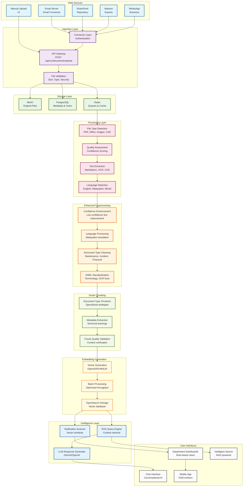

# KMRL Document Pipeline Visualization

## Enhanced Pipeline Flow Diagram



## Document Processing Stages

### Stage 1: Document Ingestion
```
Raw Documents → Connectors → API Gateway → File Validation → Storage
```

**Input**: Various document formats from multiple sources
**Processing**: Authentication, validation, initial metadata extraction
**Output**: Validated documents stored in MinIO with PostgreSQL metadata

### Stage 2: Document Processing
```
Stored Documents → File Type Detection → Quality Assessment → Text Extraction → Language Detection
```

**Input**: Validated document files
**Processing**: File type detection, quality assessment, text extraction, language detection
**Output**: Extracted text with confidence scores and language information

### Stage 3: Enhanced Preprocessing
```
Extracted Text → Confidence Enhancement → Language Processing → Document-Type Cleaning → KMRL Standardization
```

**Input**: Extracted text with metadata
**Processing**: Confidence-based enhancement, language-specific processing, document-type cleaning
**Output**: Clean, standardized text ready for chunking

### Stage 4: Smart Chunking
```
Preprocessed Text → Document-Type Chunkers → Metadata Extraction → Quality Validation
```

**Input**: Preprocessed text
**Processing**: Document-type specific chunking strategies
**Output**: Optimized chunks with metadata

### Stage 5: Embedding Generation
```
Chunks → Vector Generation → Batch Processing → OpenSearch Storage
```

**Input**: Chunked documents
**Processing**: Vector embedding generation, batch processing
**Output**: Vector embeddings stored in OpenSearch

### Stage 6: Intelligence Layer
```
Embeddings → Notification Scanner → RAG Query Engine → LLM Response Generator
```

**Input**: Vector embeddings
**Processing**: Similarity search, context retrieval, response generation
**Output**: Intelligent responses and notifications

## Data Flow Summary

1. **Documents** flow from various sources through connectors
2. **Validation** ensures file integrity and security
3. **Storage** preserves original files and metadata
4. **Processing** extracts text and detects language
5. **Preprocessing** enhances quality and standardizes content
6. **Chunking** creates optimized segments for processing
7. **Embedding** generates vector representations
8. **Intelligence** provides search and response capabilities

## Key Processing Points

- **Multilingual Support**: Malayalam translation and mixed-language processing
- **Document-Type Specific**: Specialized handling for different document categories
- **Quality Assurance**: Confidence scoring and validation throughout
- **Performance Optimization**: Batch processing and parallel execution
- **Error Handling**: Comprehensive error recovery and logging
