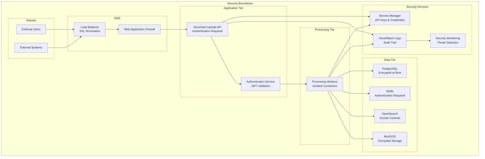

# KMRL Document Processing System - Security Threat Model

**Source**: detailed_flow.md sections 1-7, flow.md phases 1-4, flow2.md steps 1-42  
**Author**: Systems Architect  
**Date**: 2024-12-19  
**Purpose**: STRIDE threat analysis and security mitigations

## STRIDE Threat Analysis

### 1. Spoofing Threats

| Threat | Component | Risk Level | Mitigation |
|--------|-----------|------------|------------|
| API Key Theft | Connector Services | High | Rotate keys regularly, use secrets manager, monitor usage patterns |
| Session Hijacking | User Authentication | Medium | JWT tokens, HTTPS only, short expiration times |
| External System Impersonation | Data Sources | High | Certificate validation, API authentication, network isolation |

### 2. Tampering Threats

| Threat | Component | Risk Level | Mitigation |
|--------|-----------|------------|------------|
| Document Modification | File Storage | High | File integrity checks, versioning, immutable storage |
| Database Corruption | PostgreSQL | Medium | Regular backups, transaction logging, access controls |
| Queue Message Tampering | Redis | Medium | Message encryption, authentication, monitoring |

### 3. Repudiation Threats

| Threat | Component | Risk Level | Mitigation |
|--------|-----------|------------|------------|
| Upload Denial | Document Upload API | Medium | Audit logs, user authentication, request tracing |
| Processing Denial | Workers | Medium | Comprehensive logging, task tracking, user attribution |
| Notification Denial | Notification Service | Low | Delivery receipts, status tracking, audit trail |

### 4. Information Disclosure Threats

| Threat | Component | Risk Level | Mitigation |
|--------|-----------|------------|------------|
| Sensitive Document Exposure | Vector Database | High | Encryption at rest, access controls, data classification |
| User Data Leakage | User Interface | Medium | Role-based access, data masking, audit logging |
| API Response Exposure | External APIs | Medium | Response filtering, rate limiting, authentication |

### 5. Denial of Service Threats

| Threat | Component | Risk Level | Mitigation |
|--------|-----------|------------|------------|
| API Overload | Document Upload API | High | Rate limiting, auto-scaling, circuit breakers |
| Processing Queue Flood | Redis Queue | Medium | Queue size limits, priority queuing, monitoring |
| Vector Search Overload | OpenSearch | Medium | Query optimization, caching, resource limits |

### 6. Elevation of Privilege Threats

| Threat | Component | Risk Level | Mitigation |
|--------|-----------|------------|------------|
| Role Escalation | User Management | High | Principle of least privilege, role validation, audit trails |
| Service Account Abuse | Connector Services | Medium | Service-specific accounts, limited permissions, monitoring |
| Container Privilege Escalation | ECS Fargate | Low | Non-root containers, security groups, regular updates |

## Security Architecture Diagram

## Security Controls Summary

### Network Security
- VPC with private subnets for sensitive components
- Security groups with least privilege access
- NAT Gateway for outbound internet access
- Network ACLs for additional layer protection

### Data Protection
- Encryption at rest for all data stores
- Encryption in transit using TLS 1.3
- Data classification and handling procedures
- Regular security scanning and vulnerability assessment

### Access Control
- Multi-factor authentication for admin users
- Role-based access control (RBAC)
- Principle of least privilege
- Regular access reviews and audits

### Monitoring & Incident Response
- Comprehensive audit logging
- Real-time security monitoring
- Automated threat detection
- Incident response procedures
- Regular security training

## Compliance Considerations

### Data Privacy
- GDPR compliance for EU users
- Data retention policies
- Right to be forgotten implementation
- Privacy impact assessments

### Industry Standards
- SOC 2 Type II compliance
- ISO 27001 alignment
- Regular penetration testing
- Third-party security assessments
